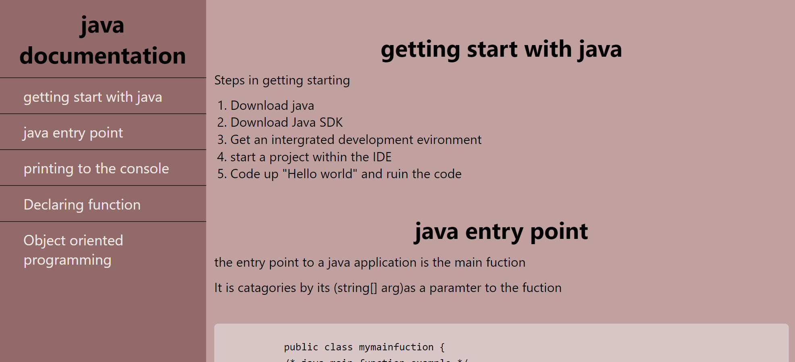

# technical-documentation-page 🚀

## Project Description 📝
This educational platform serves as a rich resource hub for Java enthusiasts, providing comprehensive information and tutorials to deepen understanding and mastery of the language.

## table of contents
- getting start with java.
- java entry point.
- printing to the console.
- Declaring function.
- Object oriented programming.

## Demo 📸


- [live demo](https://nooria150.github.io/technical-documentation-page/)

## Technologies Used 🛠️
- HTML
- CSS

## Usage 🎯

1.clone the repository to your local machine.
```bash
 git clone
```
2.after cloning write this command.
```bash
cd (choose a file)
```

3.After you choose file write this command to see all codes in vscode.
```bash
code .
```


## Author 👩‍💻

- [websire](https://github.com/Nooria150/technical-documentation-page)
- [LinkedIn:](https://www.linkedin.com/in/nooria-mangal-428a35309?utm_source=share&utm_campaign=share_via&utm_content=profile&utm_medium=ios_app)
- [Email:](nooriamangal55@gmail.com)
